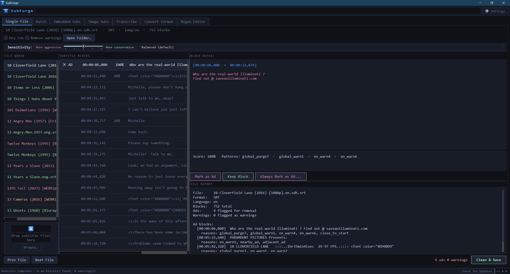
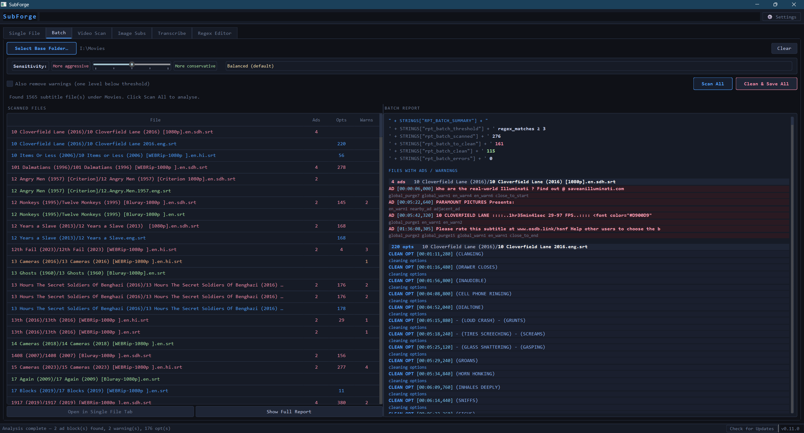
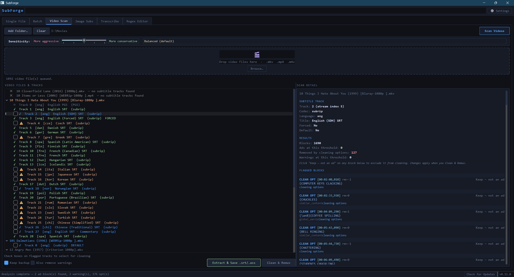
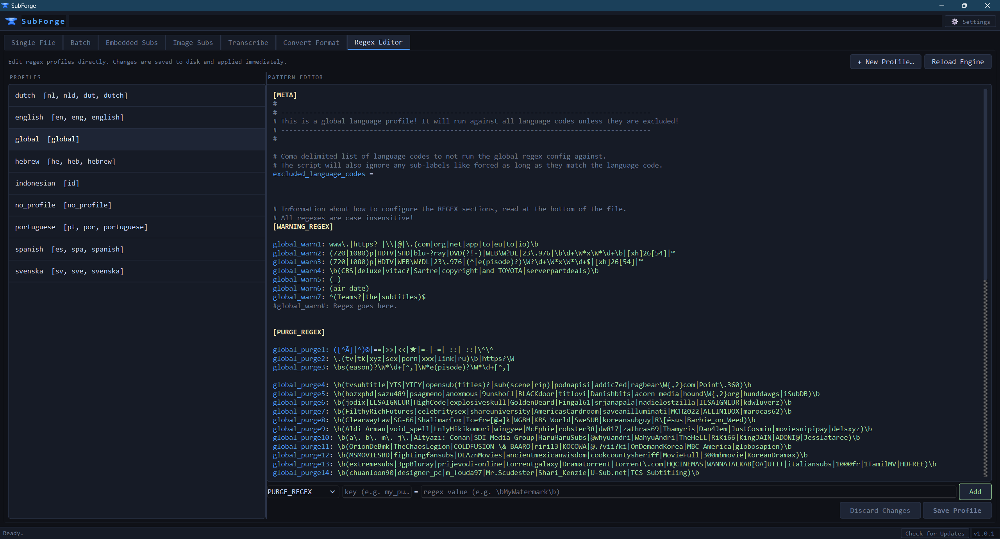

# SubScrubber — v0.7.0: Subtitle Cleaning Options

**Remove ads, watermarks, and distributor junk from subtitle files.**

SubScrubber is the ultimate, cross-platform, GUI-enabled, multi-format subtitle cleaning tool. Supports `.srt` · `.ass` · `.ssa` · `.vtt` · and embedded subtitles inside `.mkv` `.mp4` and more

Based on the detection engine from [KBlixt/subcleaner](https://github.com/KBlixt/subcleaner), extended with multi-format support, a full GUI, batch processing, embedded subtitle scanning, MKVToolNix integration, MP4 remuxing, and an in-app regex profile editor.

---

## What's New

### v0.7.0 — Subtitle Cleaning Options
- **Global Cleaning Options** — a new Settings dialog (⚙ Settings in the toolbar) provides content cleaning options that apply across Single File, Batch, and Video Scan. Options include removing music cues, SDH annotations, speaker labels, formatting tags, bracket content, case normalization, and duplicate cue merging. All options are off by default.
- **SDH accessibility warning** — the SDH annotation removal option carries a visible warning in Settings, as removing sound descriptions reduces accessibility for deaf and hard of hearing viewers. It is never a default.
- **CLEAN OPT indicators** — blocks that will be removed by cleaning options appear in blue throughout the interface: `✕ OPT` in the Single File block list, `CLEAN OPT` with a blue border in Batch and Video Scan reports, and blue file/track labels in the left panels.
- **Opts count in status bar** — the bottom bar now shows ads, warnings, and opts counts separately so you always know what will be touched before saving.
- **Track title normalization** — during any remux operation (MKV or MP4), embedded subtitle track titles are automatically normalized to the clean language name. "English - Encoded by Jackass" becomes "English". No option, always applied.
- **Global Settings dialog** — mkvmerge path has moved from the Video Scan tab into Settings > Paths. The Video Scan tab no longer has its own Settings button.
- **Cleaning actions in reports** — after a clean & save, the FILE REPORT in Single File and the detail pane in Batch show a summary of what cleaning options removed or modified, separate from the ad detection report.

### v0.6.0 — Interface Overhaul
- **Single File tab** — the former Review and Report tabs have been merged into one tab renamed Single File. The full file report now appears in a pane below the block detail, eliminating the need to switch tabs to see why a block was flagged.
- **Sensitivity slider in Single File** — the 1–5 sensitivity slider is now available on the Single File tab, matching Batch and Video Scan. Re-colors the block list instantly without rescanning.
- **Tab-scoped controls** — Dry run, Remove warnings, and Open Folder now live inside the Single File tab where they belong. They no longer appear when you are on Batch, Video Scan, or Regex Editor.
- **File queue inside Single File tab** — the file queue, block list, and detail pane are all within the Single File tab. Switching to any other tab gives that tab the full window width with no layout shift.
- **Show Full Report in Batch** — a Show Full Report button restores the full batch summary after clicking into an individual file's detail report.
- **Video Scan folder label** — the selected folder path is now displayed in the Video Scan tab after using Add Folder, matching Batch behavior.
- **Extracted subtitle filename format** — files saved via Extract & Save are now named `[video filename].[language].[ext]` (e.g. `Movie.eng.srt`). SDH tracks are automatically detected and named `Movie.eng.sdh.srt`.

### v0.5.0 — MP4 Remux Update
- **MP4 and M4V remuxing** — Clean & Remux now works on MP4 and M4V files using ffmpeg, with no additional dependencies beyond what Video Scan already requires. Backup files are created as `.backup.mp4` by default.
- **Check for Updates** — opt-in update check button in the status bar. Compares the current version against the latest GitHub release tag and opens the releases page in your browser if an update is available. Never runs automatically.
- **Semantic versioning** — version numbers now follow standard `v0.x.0` format for clear, predictable release tracking.
- **pysubs2 added to requirements** — explicitly listed as a required dependency.

---

## Why SubScrubber

Subtitle files downloaded from the internet are frequently polluted with ads, distributor watermarks, credit lines, website URLs, and promotional text embedded directly into the subtitle stream. These can range from harmless to extremely inappropriate. SubScrubber is the ultimate answer to this problem. SubScrubber gets rid of them all in an easy-to-use, all-in-one package.

### What makes SubScrubber different

**Compared to manual editing:** Finding and removing these blocks by hand in a text editor across hundreds or thousands of files is tedious and error-prone. SubScrubber automates detection across entire libraries in seconds.

**Compared to the original subcleaner:** SubScrubber extends subcleaner's detection engine with a full graphical interface, multi-format support (subcleaner only handles `.srt`), batch processing with a sensitivity slider, embedded subtitle scanning via ffprobe, MKVToolNix-based remuxing, an in-app regex editor, and is fully cross-platform compatible. Everything subcleaner does from the command line, SubScrubber does with a GUI (plus so much more).

**Compared to online subtitle cleaners:** Online tools require uploading your subtitle files to a third-party server. SubScrubber runs entirely on your own machine. No files ever leave your computer. No accounts. No internet connection required at any point during use. No ads. To this author's knowledge, there are no online subtitle cleaners that support recursive folder search uploads, additional filetypes beyond `.srt`, and cleaning embedded subtitles, all of which SubScrubber excels at.

### Key properties

- **Fully local** — zero network calls, zero telemetry, zero data collection. SubScrubber never contacts any server for any reason. The only optional exception is the opt-in Check for Updates button.
- **Cross-platform** — written entirely in Python and PyQt6, SubScrubber runs on Windows, macOS, and Linux without modification. The same code, the same interface, everywhere.
- **Open source** — every line of code is visible and auditable. The detection patterns are plain text `.conf` files you can read, edit, and extend yourself.
- **No subscription, no license, no expiry** — SubScrubber is free software. There is no paid tier, no feature gating, and no nag screens.
- **Non-destructive by default** — SubScrubber asks for confirmation before writing any file. Remux operations create a backup file by default before overwriting. Dry-run mode lets you preview exactly what would be removed without touching anything.
- **Scriptable** — the full CLI is available for automation, cron jobs, and integration with other tools, with no GUI dependency.

---

## Requirements

- Python 3.10 or newer
- FFmpeg (optional — only needed for Video Scan and MP4 remux)
- MKVToolNix (optional — only needed for Clean & Remux on MKV files)

```bash
pip install -r requirements.txt
```

`requirements.txt` installs: `PyQt6` and `pysubs2`

---

## Launching

Navigate to the SubScrubber base folder in your CLI or right-click on the File Explorer background inside the application folder where `subscrubber.py` exists and select `Open in Terminal`, then type:

```bash
# Open the GUI
python subscrubber.py --gui

# Open the GUI with a file pre-loaded
python subscrubber.py movie.en.srt --gui

# CLI only — no GUI needed
python subscrubber.py movie.en.srt
```

---

## GUI Overview

The main window has four tabs: **Single File**, **Batch**, **Video Scan**, and **Regex Editor**. A **⚙ Settings** button in the top bar opens the global Settings dialog. The status bar at the bottom shows the current state on the left, a **Check for Updates** button, and the version number on the right.

---

## Single File Tab

For loading, inspecting, and cleaning individual subtitle files.



**Workflow:**
1. Drop one or more subtitle files onto the drop zone, or use **Browse** / **Open Folder**
2. Files are analysed automatically in a background thread — the file queue on the left turns red for files with ads, orange for warnings, or green for clean. The color reflects the file's status at the time it was analyzed; it does not update when the sensitivity slider is moved
3. Each subtitle block is listed with its timestamp, confidence score, and a colour indicator (red = ad, orange = warning, grey = clean)
4. Use the **Sensitivity slider** to adjust the detection threshold — the block list re-colors instantly without rescanning
5. Click any block to see its full text in the detail pane, along with exactly which detection patterns triggered it. The full file report appears in the pane below
6. Use the three action buttons to handle each block:
   - **Mark as Ad** — flags this block for removal in this session (`Delete` key)
   - **Keep Block** — clears any flag, marks it as clean (`Space` key)
   - **Always Mark as Ad…** — opens the Add Pattern dialog (see below)
7. Click **Clean & Save** (`Ctrl+S`) to write the cleaned file — a confirmation dialog shows exactly how many blocks will be removed
8. Use **Prev File** / **Next File** to move through the queue

---

## Always Mark as Ad (Add Pattern Dialog)

The **Always Mark as Ad…** button teaches SubScrubber to recognise a pattern permanently, so it is automatically flagged in every future file — not just the current one.


**Workflow:**
1. Select a flagged or suspicious block in the Single File tab
2. Click **Always Mark as Ad…** — a dialog opens showing the block's original text
3. A regex pattern is auto-suggested based on the text:
   - URLs and domains are extracted and escaped (e.g. `www.somesite.com` → `www\.somesite\.com`)
   - Capitalised proper nouns are wrapped in word boundaries (e.g. `TeamAwesome` → `\bTeamAwesome\b`)
   - Everything else is escaped and boundary-wrapped as a fallback
4. Edit the suggested pattern if needed — it is a standard case-insensitive regex
5. Click **Test match** to verify the pattern actually matches the block text before saving
6. Choose which profile to save it to (defaults to `global.conf` which applies to all languages)
7. Choose the detection level:
   - **PURGE** — any match removes the block outright (+3 points)
   - **WARNING** — any match adds a caution flag (+1 point)
8. Click **Save** — the pattern is written to the `.conf` file, the engine hot-reloads immediately, the current block is marked as an ad, and the open file is re-analysed with the new pattern applied

---

## Batch Tab

For cleaning an entire media library in one pass, including libraries where each movie or show lives in its own subfolder.



**Workflow:**
1. Click **Select Base Folder** and choose your top-level movies or shows folder — SubScrubber walks all subfolders recursively and counts every subtitle file it finds
2. Click **Scan All** — all files are analysed in a background thread with a live progress bar
3. Results appear in the file list, colour-coded by status. Each row shows `MovieFolder/subtitle.srt` so you can see which film each file belongs to at a glance:
   - **Red** `[ N ads ]` — detection engine flagged blocks for removal
   - **Orange** `[ N warns ]` — detection engine flagged warnings
   - **Blue** `[ N opts ]` — clean from detection, but active Cleaning Options settings will modify or remove content in this file
   - **Green** `[ clean ]` — nothing will be touched
4. Click any file in the list to see a detailed report on the right — ad blocks appear with a red left border and pink text, `CLEAN OPT` blocks (flagged by Cleaning Options settings) appear with the same red styling, warnings with an orange border, timestamps in blue, and reason tags in grey below each block. Click **Keep — not an ad** on any block to exclude it from cleaning. Click **Show Full Report** at any time to return to the full batch summary
5. Use the **Sensitivity slider** (1–5) to control how aggressively blocks are flagged. Moving it instantly re-colours all rows without rescanning:
   - **1 — Very Aggressive**: catches almost everything, higher false-positive risk
   - **2 — Aggressive**: catches most ad patterns plus borderline cases
   - **3 — Balanced** *(default)*: matches subcleaner's original behaviour
   - **4 — Conservative**: only removes blocks with multiple strong matches
   - **5 — Very Conservative**: only the most obvious, unambiguous ads
6. Optionally check **Also remove warnings** to include blocks one level below the threshold
7. Click **Clean & Save All** — a confirmation dialog shows exactly how many blocks from how many files will be removed, then writes everything in one shot
8. To review a specific file in detail before cleaning, select it and click **Open in Single File Tab**

---

## Video Scan Tab

Inspects subtitle tracks embedded directly inside video container files. Useful for checking and cleaning the subtitles built into MKV and MP4 files without needing to extract them manually first.



**Requires FFmpeg** installed and available on your system PATH. If FFmpeg is missing, a notice appears at the top of the tab. See the FFmpeg installation section below.

**Workflow:**
1. Drop video files onto the drop zone, or use **Add Folder** to scan a directory recursively — the selected folder path is shown next to the controls
2. Click **Scan Videos** — SubScrubber uses `ffprobe` to enumerate all subtitle tracks in each file, then `ffmpeg` to extract each text-based track to a temporary file, then runs the full detection engine on it
3. Results appear as a collapsible tree — each video is a root node, its subtitle tracks are children, colour-coded by status (red = ads found, orange = warnings, green = clean, grey = image-based / unscannable)
4. Use the **Sensitivity slider** to adjust the detection threshold — the tree and detail pane both update instantly without rescanning
5. Click any track to see its codec, language, forced/default flags, block counts, and every flagged block with its text and matched patterns
6. For each flagged block in the detail pane, click **Keep — not an ad** to exclude that specific block from cleaning. It will be shown struck-through and marked KEPT, and will be skipped during remux or extraction
7. Check the box next to any flagged track you want to clean
8. Choose your action:
   - **Extract & Save .srt/.ass** — extracts the track, cleans it, and saves it as a standalone subtitle file next to the video, named `[video filename].[language].[ext]`. Works with any video format. Does not modify the original video. Most media players automatically detect external subtitle files.
   - **Clean & Remux** — cleans the selected tracks and rebuilds the video file with the cleaned tracks replacing the originals. See format support below.
9. Image-based subtitle formats (Blu-ray PGS, DVD VOBSUB, DVB Teletext) are detected and listed but cannot be scanned — text extraction requires OCR, which is not supported

### Clean & Remux format support

| Format | Backend | Requirement |
|---|---|---|
| `.mkv` | mkvmerge | MKVToolNix installed |
| `.mp4` / `.m4v` | ffmpeg | FFmpeg already required for Video Scan |

Both create a backup file by default (`.backup.mkv` or `.backup.mp4`) before overwriting the original. Uncheck **Keep backup** to skip this.

### MKVToolNix Settings

If `mkvmerge` is not on your system PATH, click **Settings** in the Video Scan tab to browse for `mkvmerge.exe` directly. The path is saved to `settings.json` and persists across restarts. SubScrubber also checks the default Windows install location (`C:\Program Files\MKVToolNix\mkvmerge.exe`) automatically.

---

## Regex Editor Tab

A full in-app editor for the regex pattern profiles that drive detection. Changes are saved to disk and applied immediately without restarting.



**Left panel — profile list:**
Each `.conf` file in `regex_profiles/default/` appears here with its language scope. Click one to load it into the editor.

**Right panel — pattern editor:**
The raw `.conf` file content with syntax highlighting — keys in blue, regex values in green, comments in grey, section headers in yellow. Edit directly here.

**Quick-add bar** (below the editor):
Enter a section (`PURGE_REGEX` or `WARNING_REGEX`), an optional key name, and a regex value, then click **Add**. The entry is inserted automatically. Leave the key blank to auto-generate one following the existing naming scheme (e.g. `global_purge5`, `english_warn3`).

**Saving:**
Click **Save Profile** to write changes to disk and hot-reload the detection engine. Click **Discard Changes** to revert to the last saved version.

**New profiles:**
Click **+ New Profile…**, enter a name, and a template `.conf` file is created and selected automatically.

**Manual reload:**
Click **Reload Engine** at any time to re-read all profiles from disk without saving — useful if you edited a file externally.

---

## Check for Updates

Click **Check for Updates** in the status bar at any time. SubScrubber compares the current version against the latest release tag on GitHub and shows a dialog if a newer version is available. Clicking **Open** in that dialog opens the GitHub releases page in your browser — SubScrubber never downloads or installs anything automatically.

This is the only network call SubScrubber ever makes, and only when you explicitly click the button.

---

## Installing FFmpeg (required for Video Scan and MP4 remux)

FFmpeg is a free, open-source tool that SubScrubber uses to probe and extract subtitle tracks from video files, and to remux MP4 files. It is only needed for the Video Scan tab — everything else works without it.

### Step 1 — Download FFmpeg

Go to **https://ffmpeg.org/download.html**, click **Windows**, then choose the **"Windows builds by BtbN"** link. Download the latest `ffmpeg-master-latest-win64-gpl.zip` file.

### Step 2 — Extract it

Extract the ZIP to a permanent location. A good choice is:

```
C:\ffmpeg\
```

After extracting you should have a folder structure like:

```
C:\ffmpeg\bin\ffmpeg.exe
             \ffprobe.exe
             \ffplay.exe
```

The `bin\` folder is the one that matters.

### Step 3 — Add FFmpeg to your PATH

The PATH is the list of folders Windows searches when you run a command. You need to add the `bin\` folder to it so SubScrubber (and any other program) can find `ffmpeg.exe` and `ffprobe.exe`.

1. Press **Windows + S** and search for **"Edit the system environment variables"** — open it
2. Click **"Environment Variables…"** at the bottom right
3. In the **"System variables"** section (bottom half), find the variable named **Path** and double-click it
4. Click **"New"** and paste the full path to your bin folder, e.g.:
   ```
   C:\ffmpeg\bin
   ```
5. Click **OK** on every dialog to close them all

### Step 4 — Verify it worked

Open a new PowerShell or Command Prompt window (it must be a new window — existing ones will not pick up the change) and run:

```
ffprobe -version
```

If it prints version information, FFmpeg is on your PATH and SubScrubber's Video Scan tab will work. If you still see "not recognized", double-check the path you entered in Step 3 — it should point to the folder containing `ffmpeg.exe`, not to `ffmpeg.exe` itself.

> You must open a new terminal window after editing PATH. Restarting SubScrubber after adding FFmpeg to PATH is also required.

---

## Installing MKVToolNix (required for Clean & Remux on MKV files)

MKVToolNix provides `mkvmerge`, which SubScrubber uses to rebuild MKV files with cleaned subtitle tracks replacing the originals. It is not required for MP4 remuxing.

Download from **https://mkvtoolnix.download/** and run the installer. The installer adds `mkvmerge` to your PATH automatically. SubScrubber also checks the default install location (`C:\Program Files\MKVToolNix\`) so it will usually be found even if PATH was not updated.

If SubScrubber still cannot find it, click **Settings** in the Video Scan tab and browse for `mkvmerge.exe` manually.

---

## CLI Reference

```bash
# Clean a single file (writes in place)
python subscrubber.py movie.en.srt

# Detect only — print report, do not write anything
python subscrubber.py movie.en.srt --dry-run

# Scan an entire folder recursively, ask before saving
python subscrubber.py /media/shows -r

# Scan and print report only, never prompt to save
python subscrubber.py /media/shows -r --report-only

# Include verbose output (also list clean files)
python subscrubber.py /media/shows -r --report-only -v

# Only process files tagged with a specific language
python subscrubber.py /media/shows -r --language en

# Also remove warning-level (uncertain) blocks
python subscrubber.py movie.en.srt --remove-warnings

# Skip confirmation prompt (for scripting / automation)
python subscrubber.py /media/shows -r -y

# Scan embedded subtitle tracks inside video files
python subscrubber.py movie.mkv --scan-video
python subscrubber.py /media/movies -r --scan-video

# Launch the GUI, optionally pre-loading files
python subscrubber.py --gui
python subscrubber.py movie.en.srt --gui
```

---

## What Gets Detected

Detection is driven by `.conf` regex profiles stored in `regex_profiles/default/`. Profiles can be edited in the Regex Editor tab or directly in any text editor.

| Category | Examples |
|---|---|
| Distributor watermarks | OpenSubtitles, YTS/YIFY, Addic7ed, Subscene, SubDivX, podnapisi, titlovi… |
| Named subtitle groups | Hundreds of known group names, handles, and release tags |
| Credit lines | "Subtitles by", "Sync and corrected by", "Downloaded from", "Ripped by"… |
| URLs | `http://`, `www.`, `.com` / `.net` / `.tv` / `.xyz` / `.app` domains |
| Release metadata | BluRay, WEB-DL, x264, HEVC, 1080p appearing in subtitle text |
| Promotional text | "Watch Movies & Series", "Become a VIP member", "Support us at"… |
| Language-specific patterns | English, Dutch, Spanish, Portuguese, Swedish, Hebrew, Indonesian profiles built in |

**Scoring model:**
- Each PURGE_REGEX match: **+3 points**
- Each WARNING_REGEX match: **+1 point**
- Contextual punishers each add **+1 point**: appearing in the first or last 3 blocks (`close_to_start` / `close_to_end`), being within 15 blocks of a confirmed ad (`nearby_ad`), being adjacent to a warning-level block (`adjacent_ad`), having identical content elsewhere in the file (`similar_content`), or starting in the first second of the file (`quick_start`)
- Structural detectors promote blocks without regex matches: `wedged_block` (sandwiched between confirmed ads), `chain_block` (part of a run of incrementally-growing linked blocks)
- Default threshold: **3 points = ad**, **2 points = warning**. Adjustable via the Sensitivity slider in Single File, Batch, and Video Scan tabs.

---

## Adding Custom Regex Profiles (manually)

Create a `.conf` file in `regex_profiles/default/` — or use the **+ New Profile…** button in the Regex Editor tab. Structure:

```ini
[META]
# For a language-specific profile:
language_codes = fr, fre, french

# For a global profile (applies to all languages):
# excluded_language_codes =

[PURGE_REGEX]
# Any match here removes the block outright (+3 pts per unique match)
my_purge1: some\.website\.com
my_purge2: \b(SomeWatermark|AnotherGroup)\b

[WARNING_REGEX]
# Any match here adds 1 point toward the removal threshold
my_warn1: \b(subtitles|captions)\b
```

Changes take effect immediately when saved through the Regex Editor tab. If editing files externally, use the **Reload Engine** button or restart SubScrubber.

---

## Roadmap

SubScrubber is under active development. Here is what is coming next.

**v0.8.0 — Settings Expansion**
About dialog with credits and issue reporting. Column sort on Batch. Default sensitivity preferences.

**v0.9.0 — Packaging & Distribution**
Standalone executables for Windows, macOS, and Linux via PyInstaller and GitHub Actions. First-run setup wizard. Session memory.

**v1.0.0 — Accessibility & Release**
Light and high contrast themes. Font size options. Keyboard navigation and screen reader compatibility. First translation (Spanish). Full cross-platform test pass.

**Future**
Local AI subtitle generation via Whisper — transcribe audio to subtitles entirely on-device, with SDH mode for deaf and hard of hearing viewers. Subtitle format conversion. Additional language translations.

The full roadmap is maintained in `ROADMAP.txt` in the repository.

---

*SubScrubber v0.7.0 — based on the detection engine from [subcleaner](https://github.com/KBlixt/subcleaner) by KBlixt (MIT licence)*
