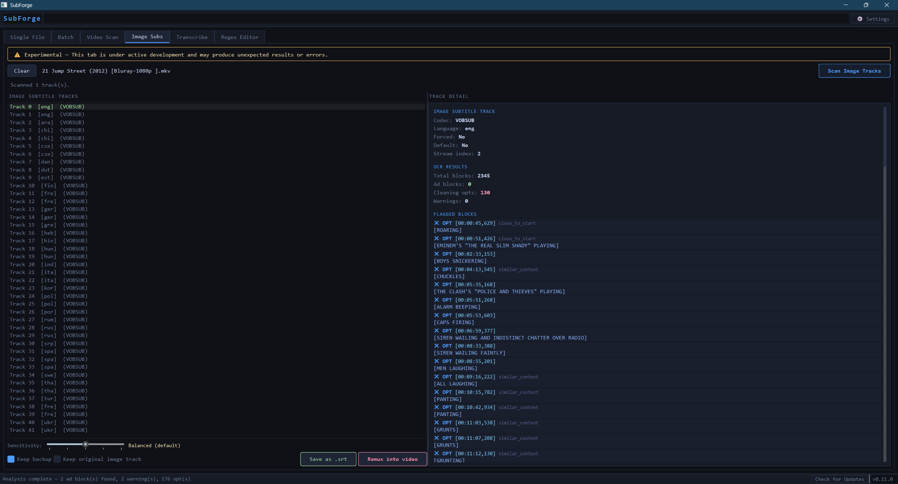
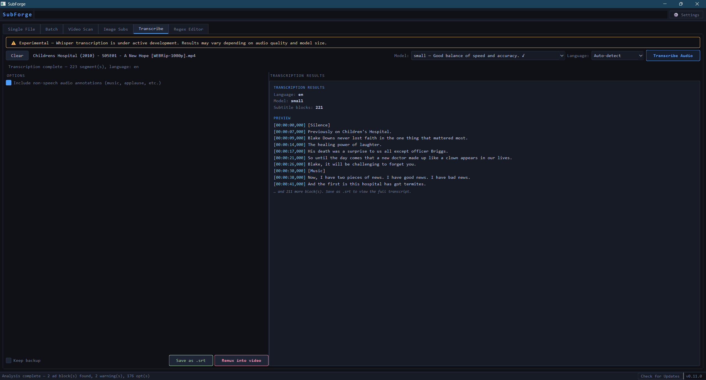
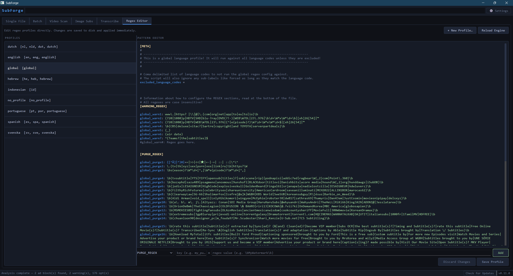

# SubForge — v0.11.0: Whisper Audio Transcription

**Clean, scan, and create subtitle files — all in one place, all on your machine.**

SubForge is the ultimate cross-platform, GUI-enabled, multi-format subtitle cleaning and creation tool. Supports `.srt` · `.ass` · `.ssa` · `.vtt` · and embedded subtitles inside `.mkv` · `.mp4` · and more — including PGS and VOBSUB image-based tracks via OCR, and audio transcription via Whisper AI.

SubForge's ad-detection engine is built on a regex-based scoring system, incorporating elements from the original detection logic in [KBlixt/subcleaner](https://github.com/KBlixt/subcleaner), and extended far beyond it: a full GUI, multi-format support, batch processing, embedded subtitle scanning, image track OCR, MKVToolNix and ffmpeg integration, AI audio transcription, and an in-app regex profile editor.

---

## What's New

### v0.11.0 — Whisper Audio Transcription
- **Transcribe tab** — a dedicated tab for generating subtitle files directly from a video's audio track using faster-whisper AI. Runs fully offline on your own machine — no cloud, no API keys, no internet required after model download.
- **Model selection** — choose from tiny, base, small, medium, or large Whisper models. Plain-language speed vs. accuracy descriptions are shown for each. Models you've already downloaded are marked with ✓.
- **Language selection** — auto-detect the spoken language, or manually specify any of 19 supported languages from the dropdown.
- **SDH mode** — when enabled, non-speech audio annotations such as `[Music]`, `[Laughs]`, and `[Applause]` are included in the transcription output. When disabled, they are stripped.
- **Save as .srt** — write the transcribed output as a standalone `.srt` file next to the video, following the same `[stem].[lang].srt` naming convention as Video Scan.
- **Remux into video** — add the transcribed subtitle track to an MKV (via mkvmerge) or MP4 (via ffmpeg) file alongside all existing tracks.
- **Settings > Paths** — a new Whisper model directory entry lets you control where downloaded models are stored. Leave blank to use the default SubForge data directory.
- **GPU acceleration** — SubForge automatically uses CUDA float16 if a compatible NVIDIA GPU and torch are available, falling back to CPU int8 otherwise.
- **14 language packs updated** — all new Transcribe tab strings are fully translated across all 14 supported interface languages.

---

## Why SubForge

Subtitle files downloaded from the internet are frequently polluted with ads, distributor watermarks, credit lines, website URLs, and promotional text embedded directly into the subtitle stream. These can range from harmless to extremely inappropriate. SubForge detects and removes all of it automatically, across entire libraries, in seconds.

But SubForge is more than a cleaner. It can scan image-based subtitle tracks that no text-based tool can touch, OCR them into editable text, and feed the result through the same detection engine. It can transcribe audio directly from a video file into a subtitle track using Whisper AI — entirely offline, with no API keys or cloud services involved. Whatever the subtitle problem is, SubForge solves it.

### What makes SubForge different

**Compared to manual editing:** Finding and removing junk blocks by hand in a text editor across hundreds or thousands of files is tedious and error-prone. SubForge automates detection across entire libraries in one pass.

**Compared to the original subcleaner:** SubForge shares subcleaner's foundational detection approach — regex profiles scored against subtitle blocks — but has been extended into a completely different application. SubForge adds a full graphical interface, support for every major subtitle format (subcleaner only handles `.srt`), batch processing with a live sensitivity slider, embedded subtitle scanning via ffprobe, MKVToolNix and ffmpeg remuxing, PGS and VOBSUB OCR via Tesseract, Whisper AI audio transcription, an in-app regex editor, and 14 language packs. The detection engine itself has been significantly expanded with additional scoring logic, contextual punishers, structural detectors, and cleaning options that go well beyond what subcleaner provides.

**Compared to online subtitle cleaners:** Online tools require uploading your files to a third-party server. SubForge runs entirely on your machine. No files ever leave your computer. No accounts. No internet connection required during use. No ads. To this author's knowledge, no online subtitle tool supports recursive folder scanning, embedded subtitle cleaning, image-track OCR, or AI audio transcription — all of which SubForge handles natively.

### Key properties

- **Fully local** — zero network calls, zero telemetry, zero data collection. SubForge never contacts any server for any reason. The only optional exception is the opt-in Check for Updates button.
- **Cross-platform** — written entirely in Python and PyQt6, SubForge runs on Windows, macOS, and Linux without modification. The same code, the same interface, everywhere.
- **Open source** — every line of code is visible and auditable. The detection patterns are plain text `.conf` files you can read, edit, and extend yourself.
- **No subscription, no license, no expiry** — SubForge is free software. There is no paid tier, no feature gating, and no nag screens.
- **Non-destructive by default** — SubForge asks for confirmation before writing any file. Dry-run mode lets you preview exactly what would be removed without touching anything.
- **Scriptable** — the full CLI is available for automation, cron jobs, and integration with other tools, with no GUI dependency.

---

## Requirements

**If using the installer or standalone executable:** no additional requirements — just download and run.

**If running from source:**
- Python 3.10 or newer
- FFmpeg (optional — only needed for Video Scan and MP4 remux)
- MKVToolNix (optional — only needed for Clean & Remux on MKV files)
- Tesseract OCR (optional — only needed for the Image Subs tab)
- faster-whisper (optional — only needed for the Transcribe tab)

```bash
pip install -r requirements.txt
```

`requirements.txt` installs: `PyQt6`, `pysubs2`, `pytesseract`, and `Pillow`. Note that `pytesseract` and `Pillow` are only required for the Image Subs tab, and `faster-whisper` is only required for the Transcribe tab — the rest of SubForge works without them.

To install faster-whisper separately:

```bash
pip install faster-whisper
```

---

## Launching

**Installer / standalone executable:** double-click the Windows installer to install SubForge — the GUI opens directly by double-clicking `SubForge.exe`.

**From source:** navigate to the repo folder and run:

```bash
# Open the GUI (or just double-click if using the executable)
python subforge.py

# Open the GUI with a file pre-loaded
python subforge.py movie.en.srt --gui

# CLI only — no GUI needed
python subforge.py movie.en.srt
```

---

## GUI Overview

The main window has six tabs: **Single File**, **Batch**, **Video Scan**, **Image Subs**, **Transcribe**, and **Regex Editor**. A **⚙ Settings** button in the top bar opens the global Settings dialog. The status bar at the bottom shows the current state on the left, a **Check for Updates** button, and the version number on the right.

---

## Single File Tab

For loading, inspecting, and cleaning individual subtitle files.


**Workflow:**
1. Drop one or more subtitle files onto the drop zone, or use **Browse** / **Open Folder**
2. Files are analysed automatically in a background thread — the file queue on the left turns red for files with ads, orange for warnings, or green for clean. The color reflects the file's status at the time it was analyzed; it does not update when the sensitivity slider is moved
3. Each subtitle block is listed with its timestamp, confidence score, and a colour indicator (red = ad, orange = warning, grey = clean)
4. Use the **Sensitivity slider** to adjust the detection threshold — the block list re-colors instantly without rescanning
5. Click any block to see its full text in the detail pane, along with exactly which detection patterns triggered it. The full file report appears in the pane below
6. Use the three action buttons to handle each block:
   - **Mark as Ad** — flags this block for removal in this session (`Delete` key)
   - **Keep Block** — clears any flag, marks it as clean (`Space` key)
   - **Always Mark as Ad…** — opens the Add Pattern dialog (see below)
7. Click **Clean & Save** (`Ctrl+S`) to write the cleaned file — a confirmation dialog shows exactly how many blocks will be removed
8. Use **Prev File** / **Next File** to move through the queue

---

## Always Mark as Ad (Add Pattern Dialog)

The **Always Mark as Ad…** button teaches SubForge to recognise a pattern permanently, so it is automatically flagged in every future file — not just the current one.


**Workflow:**
1. Select a flagged or suspicious block in the Single File tab
2. Click **Always Mark as Ad…** — a dialog opens showing the block's original text
3. A regex pattern is auto-suggested based on the text:
   - URLs and domains are extracted and escaped (e.g. `www.somesite.com` → `www\.somesite\.com`)
   - Capitalised proper nouns are wrapped in word boundaries (e.g. `TeamAwesome` → `\bTeamAwesome\b`)
   - Everything else is escaped and boundary-wrapped as a fallback
4. Edit the suggested pattern if needed — it is a standard case-insensitive regex
5. Click **Test match** to verify the pattern actually matches the block text before saving
6. Choose which profile to save it to (defaults to `global.conf` which applies to all languages)
7. Choose the detection level:
   - **PURGE** — any match removes the block outright (+3 points)
   - **WARNING** — any match adds a caution flag (+1 point)
8. Click **Save** — the pattern is written to the `.conf` file, the engine hot-reloads immediately, the current block is marked as an ad, and the open file is re-analysed with the new pattern applied

---

## Batch Tab

For cleaning an entire media library in one pass, including libraries where each movie or show lives in its own subfolder.


**Workflow:**
1. Click **Add Folder** to choose a root folder — SubForge will scan it recursively
2. Click **Scan** — every subtitle file found is analysed in a background thread. Results appear in the table as they complete
3. The table shows each file with its ad count, opts count, and warning count. Click any column header to sort
4. Use the **Sensitivity slider** to adjust the threshold — all results update instantly
5. Click any row to open the file's detail report in the right pane
6. Click **Clean All** to write cleaned versions of every file in the list, or click into a single file's detail and use the individual save controls

---

## Video Scan Tab

For scanning embedded subtitle tracks inside video files without extracting them first.


**Workflow:**
1. Click **Add Folder** to choose a folder — SubForge scans recursively for `.mkv`, `.mp4`, `.m4v`, `.avi`, `.ts`, and other container formats
2. Click **Scan** — ffprobe reads each file's subtitle streams. Text tracks are analysed immediately; image tracks are flagged for OCR
3. Each video appears in the left list with a color-coded summary of its subtitle tracks
4. Click a video to see all its subtitle tracks in the detail pane. Click a track to see its blocks
5. For clean text tracks, use **Clean & Remux** to write a new video with the cleaned subtitle replacing the original
6. For image tracks, use **Open in Image Subs →** to hand the file off to the Image Subs tab for OCR

---

## Image Subs Tab

For scanning PGS (Blu-ray) and VOBSUB (DVD) image-based subtitle tracks using Tesseract OCR.



**Workflow:**
1. Drop a video file onto the drop zone, or use the handoff button from Video Scan
2. SubForge extracts one bitmap per subtitle event, runs Tesseract OCR, and assembles the text into a subtitle file
3. The detection engine runs on the OCR output unchanged — the same pipeline as text tracks
4. Use the **Sensitivity slider** to adjust the detection threshold
5. Use **Save as .srt** to write the OCR'd subtitle as a standalone file next to the video
6. Use **Remux into video** to add the text track to the video — on MKV, you can choose to replace or keep the original image track alongside it

---

## Transcribe Tab

For generating subtitle files from a video's audio track using Whisper AI — entirely on your own machine, with no internet connection required after model download.



**Workflow:**
1. Drop a video file onto the drop zone, or use **Browse**
2. Choose a **Model** (small is a good starting point; large gives the best accuracy)
3. Choose a **Language** (Auto-detect works well for most content)
4. Check **Include non-speech audio annotations** if you want `[Music]`, `[Laughs]`, etc. included in the output
5. Click **Transcribe Audio** — the model downloads on first use and is cached locally for all future runs
6. When transcription completes, use **Save as .srt** to write the subtitle file, or **Remux into video** to add it directly to the video file

> **Note:** faster-whisper must be installed separately: `pip install faster-whisper`. It is not bundled in the Windows installer. When running from the installer, faster-whisper must be installed via pip in a Python environment that is on your system PATH.

---

## Regex Editor Tab

For managing and editing the regex profiles that drive ad detection.



**Workflow:**
1. Choose a profile from the dropdown (e.g. `global.conf`, `english.conf`)
2. Edit patterns in the PURGE_REGEX or WARNING_REGEX sections
3. Click **Save** — the engine hot-reloads immediately and all open files are re-analysed
4. Use **+ New Profile…** to create a language-specific profile
5. Use **Test** to verify a pattern against sample text before saving

---

## Installing FFmpeg (required for Video Scan and MP4 remux)

FFmpeg provides `ffprobe` (used for subtitle stream detection) and `ffmpeg` (used for MP4 remuxing and image subtitle extraction). It is not required for cleaning standalone subtitle files.

### Step 1 — Download FFmpeg

Go to **https://www.gyan.dev/ffmpeg/builds/** and download the latest **release build** (the `ffmpeg-release-essentials.zip` file). Extract the zip to a permanent location, for example `C:\ffmpeg\`.

### Step 2 — Locate the bin folder

Inside the extracted folder you will find a `bin\` subfolder containing:

```
\ffmpeg.exe
\ffprobe.exe
\ffplay.exe
```

The `bin\` folder is the one that matters.

### Step 3 — Add FFmpeg to your PATH

The PATH is the list of folders Windows searches when you run a command. You need to add the `bin\` folder to it so SubForge (and any other program) can find `ffmpeg.exe` and `ffprobe.exe`.

1. Press **Windows + S** and search for **"Edit the system environment variables"** — open it
2. Click **"Environment Variables…"** at the bottom right
3. In the **"System variables"** section (bottom half), find the variable named **Path** and double-click it
4. Click **"New"** and paste the full path to your bin folder, e.g.:
   ```
   C:\ffmpeg\bin
   ```
5. Click **OK** on every dialog to close them all

### Step 4 — Verify it worked

Open a new PowerShell or Command Prompt window (it must be a new window — existing ones will not pick up the change) and run:

```
ffprobe -version
```

If it prints version information, FFmpeg is on your PATH and SubForge's Video Scan tab will work. If you still see "not recognized", double-check the path you entered in Step 3 — it should point to the folder containing `ffmpeg.exe`, not to `ffmpeg.exe` itself.

> You must open a new terminal window after editing PATH. Restarting SubForge after adding FFmpeg to PATH is also required.

---

## Installing MKVToolNix (required for Clean & Remux on MKV files)

MKVToolNix provides `mkvmerge`, which SubForge uses to rebuild MKV files with cleaned subtitle tracks replacing the originals. It is not required for MP4 remuxing.

Download from **https://mkvtoolnix.download/** and run the installer. The installer adds `mkvmerge` to your PATH automatically. SubForge also checks the default install location (`C:\Program Files\MKVToolNix\`) so it will usually be found even if PATH was not updated.

If SubForge still cannot find it, click **Settings** in the Video Scan tab and browse for `mkvmerge.exe` manually.

---

## CLI Reference

```bash
# Clean a single file (writes in place)
python subforge.py movie.en.srt

# Detect only — print report, do not write anything
python subforge.py movie.en.srt --dry-run

# Scan an entire folder recursively, ask before saving
python subforge.py /media/shows -r

# Scan and print report only, never prompt to save
python subforge.py /media/shows -r --report-only

# Include verbose output (also list clean files)
python subforge.py /media/shows -r --report-only -v

# Only process files tagged with a specific language
python subforge.py /media/shows -r --language en

# Also remove warning-level (uncertain) blocks
python subforge.py movie.en.srt --remove-warnings

# Skip confirmation prompt (for scripting / automation)
python subforge.py /media/shows -r -y

# Scan embedded subtitle tracks inside video files
python subforge.py movie.mkv --scan-video
python subforge.py /media/movies -r --scan-video

# Launch the GUI, optionally pre-loading files
python subforge.py --gui
python subforge.py movie.en.srt --gui
```

---

## What Gets Detected

Detection is driven by `.conf` regex profiles stored in `regex_profiles/default/`. Profiles can be edited in the Regex Editor tab or directly in any text editor.

| Category | Examples |
|---|---|
| Distributor watermarks | OpenSubtitles, YTS/YIFY, Addic7ed, Subscene, SubDivX, podnapisi, titlovi… |
| Named subtitle groups | Hundreds of known group names, handles, and release tags |
| Credit lines | "Subtitles by", "Sync and corrected by", "Downloaded from", "Ripped by"… |
| URLs | `http://`, `www.`, `.com` / `.net` / `.tv` / `.xyz` / `.app` domains |
| Release metadata | BluRay, WEB-DL, x264, HEVC, 1080p appearing in subtitle text |
| Promotional text | "Watch Movies & Series", "Become a VIP member", "Support us at"… |
| Language-specific patterns | English, Dutch, Spanish, Portuguese, Swedish, Hebrew, Indonesian profiles built in |

**Scoring model:**
- Each PURGE_REGEX match: **+3 points**
- Each WARNING_REGEX match: **+1 point**
- Contextual punishers each add **+1 point**: appearing in the first or last 3 blocks (`close_to_start` / `close_to_end`), being within 15 blocks of a confirmed ad (`nearby_ad`), being adjacent to a warning-level block (`adjacent_ad`), having identical content elsewhere in the file (`similar_content`), or starting in the first second of the file (`quick_start`)
- Structural detectors promote blocks without regex matches: `wedged_block` (sandwiched between confirmed ads), `chain_block` (part of a run of incrementally-growing linked blocks)
- Default threshold: **3 points = ad**, **2 points = warning**. Adjustable via the Sensitivity slider in Single File, Batch, and Video Scan tabs.

---

## Adding Custom Regex Profiles (manually)

Create a `.conf` file in `regex_profiles/default/` — or use the **+ New Profile…** button in the Regex Editor tab. Structure:

```ini
[META]
# For a language-specific profile:
language_codes = fr, fre, french

# For a global profile (applies to all languages):
# excluded_language_codes =

[PURGE_REGEX]
# Any match here removes the block outright (+3 pts per unique match)
my_purge1: some\.website\.com
my_purge2: \b(SomeWatermark|AnotherGroup)\b

[WARNING_REGEX]
# Any match here adds 1 point toward the removal threshold
my_warn1: \b(subtitles|captions)\b
```

Changes take effect immediately when saved through the Regex Editor tab. If editing files externally, use the **Reload Engine** button or restart SubForge.

---

## Roadmap

SubForge is under active development. Here is what is coming next.

**v0.12.0 — Transcribe Tab: Inline Editing**
Edit transcription results directly in the Transcribe tab before saving or remuxing — click any subtitle line to correct it, then output uses your edits.

**v0.13.0 — Diagnostics & Polish**
Error log viewer in Settings. Unified error logging across all tabs. Consistent log storage between source and installer modes.

**v1.0.0 — Accessibility & Release**
Light and high contrast themes. Font size options. Keyboard navigation and screen reader compatibility. Full cross-platform test pass.

The full roadmap is maintained in `ROADMAP.txt` in the repository.

---

*SubForge v0.11.0 — based on the detection engine from [subcleaner](https://github.com/KBlixt/subcleaner) by KBlixt (MIT licence)*
